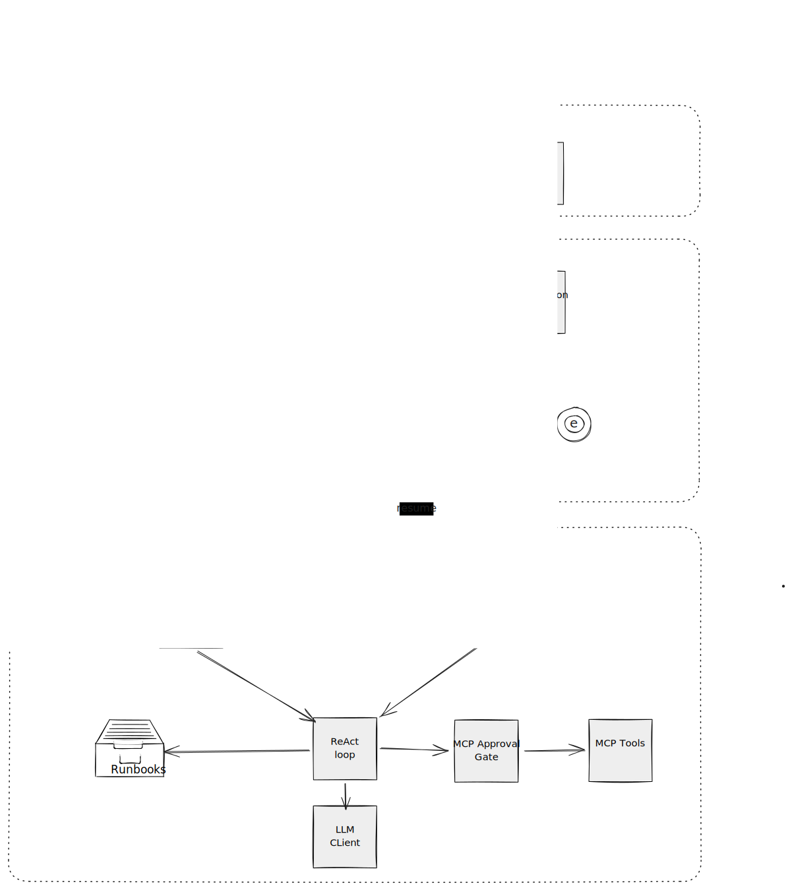
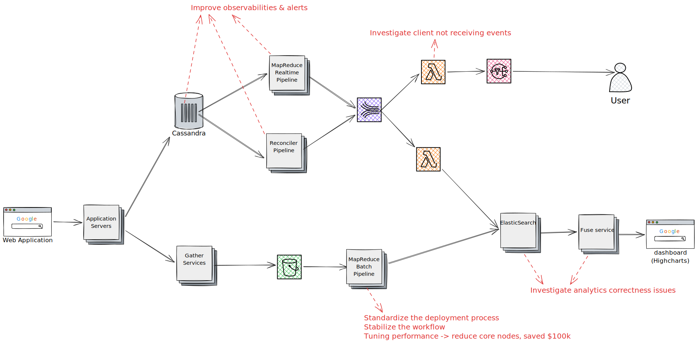

# Overview

# Full-stack web app

Happy Kids: https://github.com/bachtly/happy-kids
-> Give repo and architecture diagram

Landingly: https://github.com/Landingly/landingly
-> Show the codebase on screen

Others:
- Tivian: PHP + template
- Khoros: React + Java
- OL Vietnam: JS + .NET

# Workflows

Zendesk automation AI agent + DBOS
M$ automation inhouse tool

# Integrations

- FedEx (SOAP - XML), Taylor: order fulfillment
- Zendesk: ticket management
- StrataMax, PIQ: strata financial data
- LemonSqueezy: payment 
- WhatsApp: business messaging

Patterns: 
- prefer webhooks than polling
- has reconcile flow to backfill failing messages
- metrics & alerts for failures

# Tracking

FedEx, Taylor: status update

Shipment Visibility POC: https://github.com/bachtly/shipment-visibility-workflow

# Infra - Cloud

- CI/CD: Github Action, Jenkins & Concourse CI
- IaC across Azure + AWS, mostly terraform

IaC code sample: https://github.com/bachtly/shipment-visibility-workflow

# Analytics - ETL

# Notifications

Expo push notification (Happy Kids)
Khoros Firehose: SQS for OLTP
Email notification
